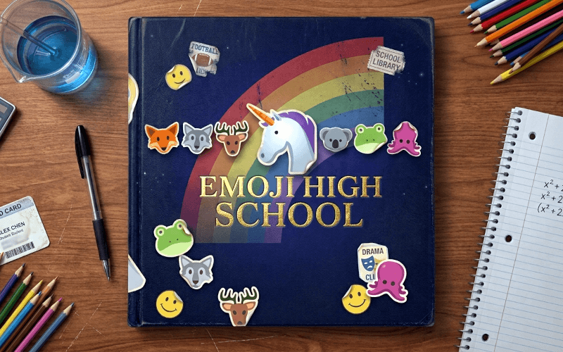

# 🏫 Emoji High School

# [PLAY ENHANCED VERSION](https://killedbyapixel.github.io/EmojiHighSchool/)

# [OFFICIAL JS13K PAGE](https://js13kgames.com/2026/games/emoji-high-school)

**One school year. Six classmates. The only language you speak is emoji.**

Everyone is hiding what they love. Every emoji has a club, a colour and tags — none of it hidden. Send someone a picture and read the face that comes back: 🍓 landing well could mean *red*, *food* or *tiny*. Send another to find out which.

Nobody's taste is written down. It's rolled from a seed, so no guide can spoil it. You have forty weeks, and on the final day you can hand one of them the emoji they love most in the world and win their heart.

## 🕹️ Controls

Mouse or touch; the game is one phone. - ⭐ = a slot you haven't spent, 🔋 = the week has something left, 🔊🎵 = sound and music.

**🌈 load Twemoji font** leads the cards on the home screen. A 13kb entry can't ship a font, so it's only fetched if you ask; until then the emoji are your device's own.

## 📱 How to Play

Three slots a week, and nothing carries over.

- **🏫 School.** Pick a club, learn one of three emoji, and run into whoever likes what you learned. Your collection is everything you can say.
- **💬 The phone.** *One* action: text, give a present, or ask someone out — answering one costs it too.
- **🌤️ The weekend.** The date you booked, or a trip alone for emoji school won't teach you.

A message is two slots, each an emoji or a face: 🙂 **just saying** halves the score either way, 😍 **I mean it** doubles it, ❓ **why?** names the opinion your emoji touched.

Play it safe while guessing; say it like you mean it once you're sure. 📓 Notes remembers every reaction.

## 🌈 Features

- 141 emoji sharing 41 attributes, so what you learn about one tells you about others
- Forty weeks of clubs, exams, dates, trips, birthdays, presents and jealousy
- Five moods, and classmates who give up on you if you go quiet
- Unicorn Week 🦄, a free emoji that goes with everything
- Three endings, a yearbook, procedural music, ZzFX sound, vanilla JS
